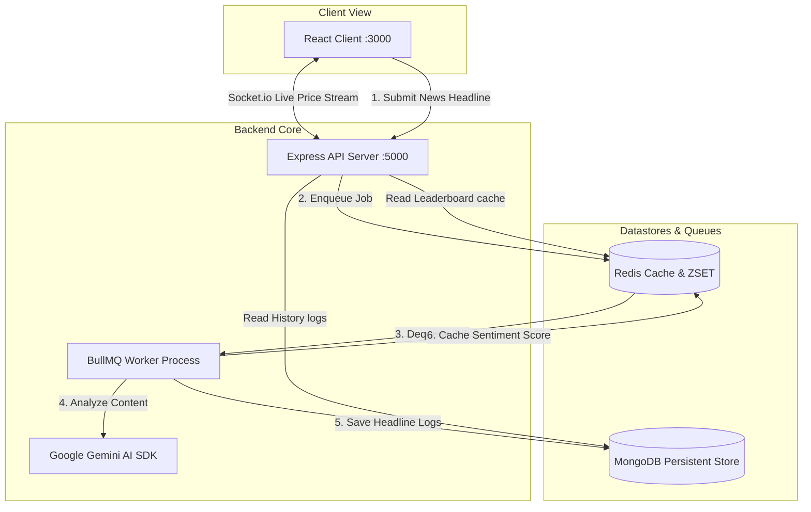

# StockPulse AI — Onboarding & Setup Guide

Welcome to **StockPulse AI**! This MERN stack application provides real-time stock price tracking, live updates via Socket.io, headline queueing using BullMQ, and AI-powered sentiment analysis with Google Gemini. 

---

## 📈 System Architecture

Here is the data and event flow between MERN modules and backing services:



---

## 🛠️ Prerequisites

Before launching the project, ensure you have the following installed on your machine:
* **Node.js** (v18.0.0 or higher)
* **npm** (v9.0.0 or higher)
* **Docker Desktop** (or standalone Docker & Docker Compose)

---

## 🚀 Step-by-Step Setup

### 1. Clone & Set Up Directory
Clone the repository to your local machine:
```bash
git clone https://github.com/your-username/StockPulseAI.git
cd StockPulseAI
```

---

### 2. Launch Backing Services (Docker)
We use Docker Compose to run **MongoDB** and **Redis** containers. Ensure Docker Desktop is active, then spin up the services from the project root:
```bash
docker compose up -d
```
This launches:
* **Redis** (Port `6379`): Handles live price stream queues and caches the Sentiment Leaderboard.
* **MongoDB** (Port `27017`): Stores news articles, logs, and historical sentiment weights.

To verify containers are active:
```bash
docker ps
```

---

### 3. Configure Backend Environment
Navigate to the `backend/` folder:
```bash
cd backend
npm install
```

Create a `.env` file inside the `backend/` directory and configure the environment variables:
```ini
# Backend API Port
PORT=5000

# Redis Database Connection String
REDIS_URL=redis://localhost:6379

# MongoDB Connection String
MONGO_URL=mongodb://localhost:27017/stockpulse_db

# Google Gemini API Key (Required for AI Sentiment processing)
GEMINI_API_KEY=YOUR_GOOGLE_GEMINI_API_KEY_HERE

# Price feed simulator source (MOCK / LIVE)
DATA_SOURCE=MOCK
```

> [!TIP]
> You can acquire a free Google Gemini API key by visiting Google AI Studio.

---

### 4. Seed Initial Sentiment Data (Optional)
To seed initial news analysis logs and calculate starting scores, run the seed script:
```bash
node seedHeadlines.js
```

---

### 5. Start Backend Services
You will need to open **two terminal windows** inside the `backend/` folder to run the API and worker processes concurrently.

* **Terminal 1: Start Express API Server**
  ```bash
  node src/index.js
  ```
  *(Server runs on port `5000`)*

* **Terminal 2: Start BullMQ Worker**
  ```bash
  node worker.js
  ```
  *(Listens to headline queues and parses Gemini responses)*

---

### 6. Launch Frontend Client
Open a new terminal window, navigate to the `frontend/` folder, install packages, and start the development server:
```bash
cd frontend
npm install
npm start
```
The React application will launch in your default browser at `http://localhost:3000`.

---

## 📁 Repository Layout

```text
StockPulseAI/
├── backend/
│   ├── src/
│   │   ├── models/        # Mongoose Schema Definitions (Sentiment, etc.)
│   │   ├── queues/        # BullMQ config and Redis client initialization
│   │   ├── services/      # Simulation Services & Decay Calculations
│   │   └── index.js       # Main Express API and Socket.io setup
│   ├── worker.js          # Background BullMQ processing script
│   ├── seedHeadlines.js   # Initial DB seeder utility
│   ├── package.json
│   └── .env               # Secrets configuration (DO NOT COMMIT)
├── frontend/
│   ├── src/
│   │   ├── App.js         # Main Dashboard React component
│   │   ├── index.css      # Core Tailwind styling overrides
│   │   └── index.js
│   ├── package.json
│   └── README.md
├── docker-compose.yml     # Backing MongoDB & Redis containers
└── README.md              # Onboarding documentation
```
